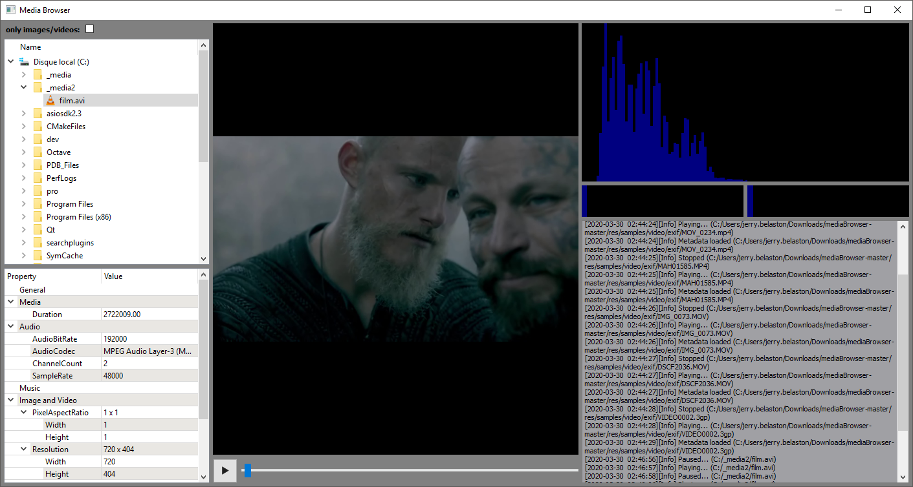

# Media Browser

Copyright (C) 2020, Jerry Belaston

## Overview

This C++ media browser appplication is a simple demonstration of the use of some basic and customized Qt widgets. 

The following features are implemented:
- File System Browser: based on `QtTreeView`/`QFileSystemBrowser`, allows to browse files with the option to filter image/video if needed.
- Media vizualization: based on `QMediaPlayer`, allows standard play/pause/move actions.
- Metadata browser: based on `qtTreePropertyBrowser` (from Qt sources), allows to organize the display of media metadata.
- Video & Audio spectrum analyzer: retrieved and customed from internet, shows how to draw in a `QDevice` using `QPainter`.
- Quick homemade logger (based on `QTextEditor`) allowing to track media player states.

Note that `QMediaPlayer` is used to extract metadata. Unfortunately, it doesn't seems to manage correctly EXIF data extraction.

## Change log

v1.0.0 - 30/03/2020 - First demo sample

## Demo (binary app)

- Open the [exe](exe) folder.
- Unzip demo archive on your PC outside this repository.
- Launch **mediaBrowser.exe** (Look into "_samples" folder for some media files).

## Minimum requirements for compilation

- Windows 10
- CMake 3.15.2
- Visual Studio 2019 16.4.2 (using platform toolset v142)
- Qt 5.15.0 (including MSVC 2019 32bits compiler and Qt Sources)

## Compilation

- Clone this repository.
- Run `run_cmake_vs.sh` script which will generate `_build_<toolset>` solution folder.
- Open `.sln` generated solution (`mediaBrowser` is the default target).
- Build solution.
- Run `mediaBrowser` target: you are done!

## Root folders definition

- `doc` as documentation, contains technical implementation info
- `exe` as executable, contains a demo
- `ext` as external, contains external libraries/dependencies
- `res` as resources, contains Media Browser resources and media samples
- `src` as source, contains source code
