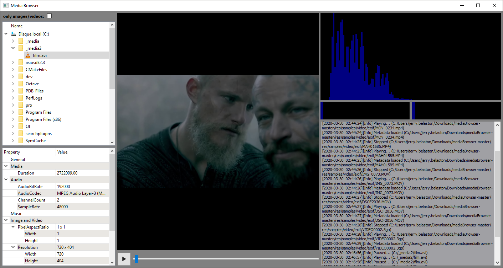

# Media Browser

Copyright (C) 2020, Jerry Belaston

## Overview

**As a response to the first exercice of the technical test** (more info in [doc](doc) folder), this demo provides the following features:
* File System Browser (based on QtTreeView/QFileSystemBrowser) with the possibility of displaying only image/video if needed.
* Media vizualization with classical play/pause/move actions (based on QMediaPlayer)
* Metadata browser (based on the qtTreePropertyBrowser component retrieved from the Qt sources) allowing to display media metada including exif info
* Video & Audio spectrum analyser (retrieved and customed from internet)
* Quick Logger (based on QTextEditor) allowing to track media player states.

The following requirements have not been implemented :

* Filtering of files regarding analysis results

## Change log

v1.0.0 - 30/03/2020 - First demo sample

## Demo (Binary app)

* Open the [exe](exe) folder
* Unzip demo archive outside this repository, on you PC
* Launch **mediaBrowser.exe** (Look into "_samples" folder for some media files)

## Minimum requirements for compilation

* CMake 3.15.2
* Visual Studio 2019 16.4.2 (using platform toolset v142)
* Qt 5.15.0 (including MSVC 2019 32bits compiler and Qt Sources)

## Compilation

* Clone this repository
* Run run_cmake_vs.sh script which will generates _build\<toolset\> solution folder (run run_cmake_vs.sh -h to get help)
* Open *\.sln generated solution (mediaBrowser is the default target)
* Build solution
* Run mediaBrowser target: you are done!

## Third party

* Qt

## Root folder definitions

* doc: as documentation, contains technical implementation info
* exe: as executable, contains a demo
* ext: as external, contains external libraries/dependencies
* res: as resources, contains Media Browser resources and media samples
* src: as source, contains source code
